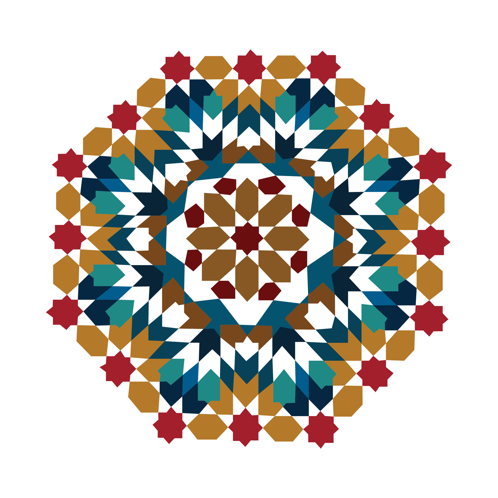

# Medina Navigator

Medina Navigator is an AI-powered guide that helps visitors explore and understand Morocco's rich cultural heritage. The application provides real-time insights, navigation assistance, and cultural information through an interactive interface.

## Features

### 🔍 Instant Recognition
- Take photos of architectural details, crafts, or landmarks
- Get immediate historical context and cultural significance
- AI-powered image analysis for accurate identification

### 🧭 Smart Navigation
- Discover nearby heritage sites
- Find traditional food spots and artisan workshops
- Get real-time location-aware updates
- Create personalized walking tours

### 🌍 Cultural Insights
- Learn about local traditions and customs
- Understand proper etiquette
- Discover the stories behind historical sites
- Get insider tips from local experts

### 🍳 Food Discovery
- Find authentic local cuisine
- Locate traditional food spots
- Get recommendations for local delicacies

### ⏰ Real-Time Updates
- Check opening hours
- View current prices
- Monitor crowd levels
- Get live updates about points of interest

## Technology Stack

- Next.js (React Framework)
- TypeScript
- Tailwind CSS
- Lucide Icons
- AI-powered image recognition
- Geolocation services