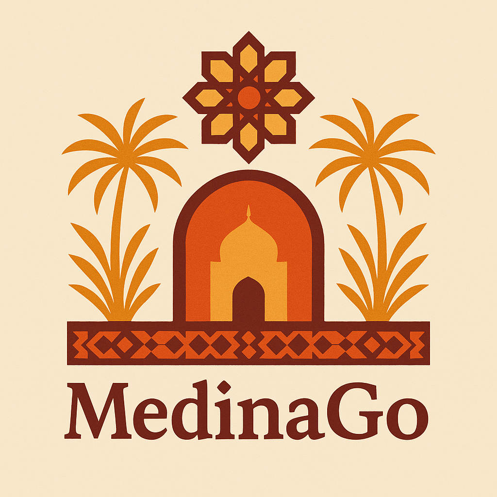
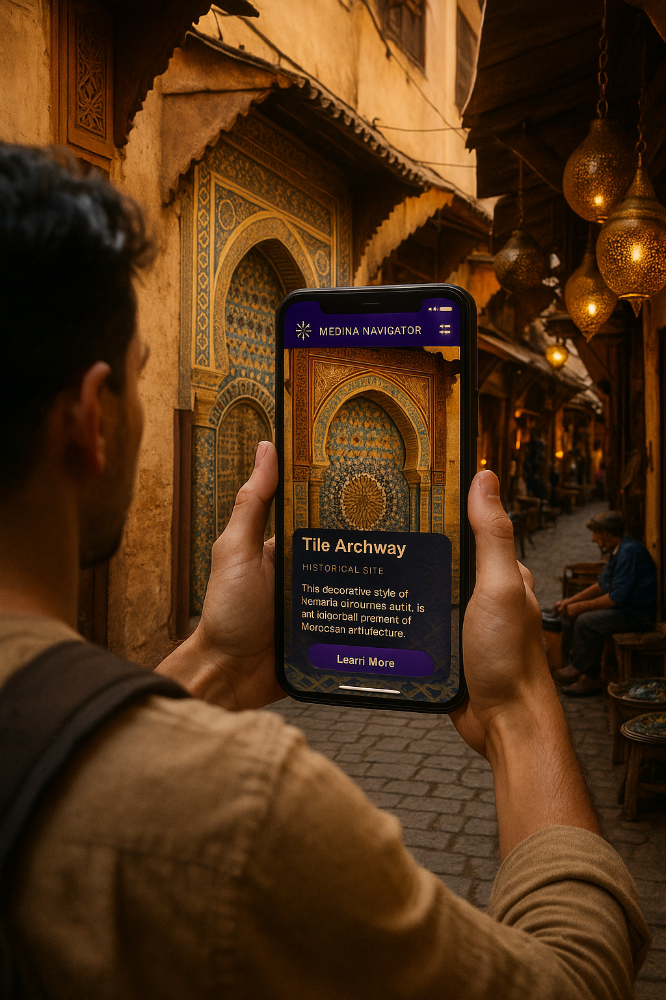

# 🧭 MedinaGo

**MedinaGo** is an AI-powered cultural companion designed to enrich travelers’ experiences exploring Morocco’s historic medinas. It offers real-time insights into local heritage, smart navigation, and immersive storytelling—all through a mobile-first interface.

---

## 📸 How it works in real life

---

## 🧩 Project Overview

MedinaGo blends AI technologies with Morocco’s rich cultural heritage. Users can scan landmarks, receive contextual cultural information, and navigate historical sites with curated content—simply by pointing their camera or walking through the medina.

---

## 🔧 Development Workflow

1. **Ideation & Research**
   - Focus on Morocco’s medinas (Fez, Marrakech) as cultural hotspots.
   - Identify user needs: navigation, cultural learning, immersion.

2. **Design & UX**
   - Wireframes and mockups inspired by Moroccan aesthetics (zellige patterns, warm tones).
   - Mobile-first layout with pseudo-AR overlay and audio guidance.

3. **Core Implementation**
   - Next.js-based frontend with dynamic components.
   - AI-powered landmark recognition integrated via remote general AI API.

4. **Testing & Optimization**
   - Field tests in medinas with real users.
    

---

## 💡 Features

### 🔍 Instant Visual Recognition & Real-Time Audio Mode

- Capture live shots from the user camera.
- Send images to a remote AI general model (GPT) for scene understanding.
- Receive textual output converted immediately into voice feedback.
- Real-time **audio guide** mode enables hands-free, context-aware narration without visual overlays.
- Works offline after initial caching for common landmarks.

### 🧭 Smart Cultural Navigation

- Suggests nearby cultural and historical points of interest.
- Recommends local artisans, workshops, and food stalls.
- Generates personalized walking tours within the medina.

### 🌍 Rich Cultural Insights

- Explains historical significance, local customs, and etiquette.
- Delivers curated stories and practical travel tips.

---

## 🛠️ Technology Stack

| Layer              | Tools & Libraries                                   |
| ------------------ | --------------------------------------------------- |
| **Frontend**       | Next.js (React Framework), TypeScript, Tailwind CSS |
| **AI Integration** | Remote GPT API for scene understanding               |
| **UX/UI**          | Figma, Tailwind, Framer Motion                      |
| **Data Handling**  | JSON content, SWR for data fetching                  |

---

## 🧪 Techniques Used

- **AI-Powered Scene Understanding:** General AI model interprets live camera frames remotely.
- **Real-Time Audio Mode:** Converts AI text outputs into immediate speech for hands-free use.
- **Geofencing & Location Context:** Triggers contextual information based on user coordinates.
- **Cultural Content Curation:** Sourced from Moroccan heritage databases and field research.

---

## 🗺️ Future Enhancements

- Add true AR visual overlays to combine with audio guide (full AR Mode).
- Multi-language support.
- Voice-driven Q&A interaction.
- Offline-first caching improvements for rural connectivity.

---

## 📱 Interaction Modes

- **Real-Time Audio Mode:** Continuous camera feed analyzed by remote AI; audio descriptions delivered in real-time without visual overlays.
- **Chat Mode:** Text and photo Q&A for detailed exploration.
- **Photo Mode:** Single-shot landmark recognition on demand.

---

## 🧭 Summary

MedinaGo empowers travelers to discover Morocco’s medinas in a rich, immersive way—combining AI-powered cultural storytelling with smart navigation and hands-free audio guidance. It bridges the gap between tradition and technology, supporting cultural preservation and enhancing the visitor experience.

---

