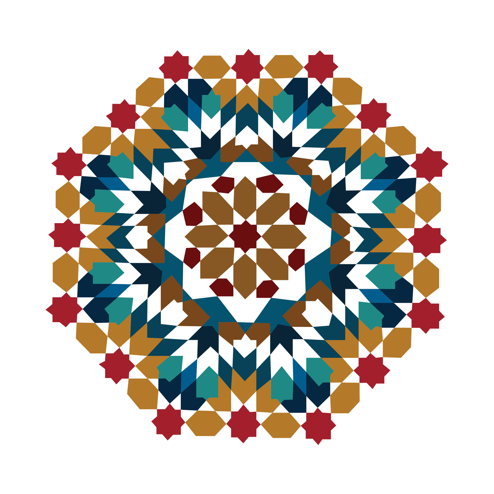

# Medina Navigator



Medina Navigator is an AI-powered guide that helps visitors explore and understand Morocco's rich cultural heritage. The application provides real-time insights, navigation assistance, and cultural information through an interactive interface.

## Features

### 🔍 Instant Recognition
- Take photos of architectural details, crafts, or landmarks
- Get immediate historical context and cultural significance
- AI-powered image analysis for accurate identification

### 🧭 Smart Navigation
- Discover nearby heritage sites
- Find traditional food spots and artisan workshops
- Get real-time location-aware updates
- Create personalized walking tours

### 🌍 Cultural Insights
- Learn about local traditions and customs
- Understand proper etiquette
- Discover the stories behind historical sites
- Get insider tips from local experts

### 🍳 Food Discovery
- Find authentic local cuisine
- Locate traditional food spots
- Get recommendations for local delicacies

### ⏰ Real-Time Updates
- Check opening hours
- View current prices
- Monitor crowd levels
- Get live updates about points of interest

## Technology Stack

- Next.js (React Framework)
- TypeScript
- Tailwind CSS
- Lucide Icons
- AI-powered image recognition
- Geolocation services

## Getting Started

### Prerequisites

- Node.js (v14 or higher)
- npm or yarn

### Installation

1. Clone the repository:
```bash
git clone https://github.com/yourusername/medina-navigator.git
```

2. Navigate to the project directory:
```bash
cd medina-navigator
```

3. Install dependencies:
```bash
npm install
# or
yarn install
```

4. Start the development server:
```bash
npm run dev
# or
yarn dev
```

5. Open your browser and visit `http://localhost:3000`

## Usage

1. Click "Get Started" to begin exploring
2. Use the camera feature to take photos of interesting architectural details
3. Allow location access to discover nearby points of interest
4. Follow the interactive guides and recommendations
5. Explore the rich cultural heritage of the Medina

## Contributing

We welcome contributions to Medina Navigator! Please read our contributing guidelines before submitting pull requests.

1. Fork the repository
2. Create your feature branch (`git checkout -b feature/AmazingFeature`)
3. Commit your changes (`git commit -m 'Add some AmazingFeature'`)
4. Push to the branch (`git push origin feature/AmazingFeature`)
5. Open a Pull Request

## License

This project is licensed under the MIT License - see the LICENSE file for details.

## Contact

- Website: [medinanavigator.com](https://medinanavigator.com)
- Email: contact@medinanavigator.com

## Acknowledgments

- Thanks to all contributors who have helped shape Medina Navigator
- Special thanks to the local experts and historians who provided cultural insights
- Moroccan artisans and craftspeople who preserve these beautiful traditions
